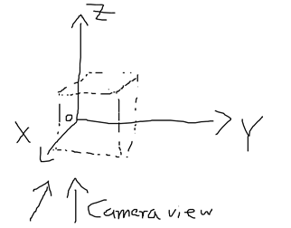

# proPTV_OpenPTV_MyPTV_comparison
 An attempt to merge some knowledge

## Installation instructions

### How to install OpenPTV-Python

if you need to install openptv-python, it's recommended to use conda
Create conda environment with openptv-python

    conda create -n openptv_lineofsight python=3.10
    conda activate openptv_lineofsight

If you run it on the Codespaces, the python is already encapsulated, simply use pip:

    pip install git+https://github.com/openptv/openptv-python.git
    pip install jupyter matplotlib numpy numba

### How to install MyPTV:

    git clone --depth 1 --branch extended_zolof_calibration --single-branch https://github.com/ronshnapp/MyPTV.git
    cd MyPTV
    pip install -e .
    cd ..

### Add interactive matplotlib option 

    pip install ipympl

### Tracking project started

Data location: on our shared Dropbox https://www.dropbox.com/scl/fo/ijswwifg4iinan0hkwmn6/AFDwAAl2gehLDqAVqqG7lWA?rlkey=nhhasxknndgh3unkghggl1mml&dl=0

Data explanation: see in the same Dropbox folder the .eml message 

Dear all,

 

you can download the dataset at: https://gigamove.rwth-aachen.de/de/download/6b22d91cb7fb50f7278cec8b45be23a3

 

We now have 50000 particles over 30 time steps.

You can find the particle 3D data in the origin/origin_{time}.txt files.

They include rows: # ID X Y Z x0 y0 x1 y1 x2 y2 x3 y3 , were xi yi correspond to the camera position on camera i.

Please load the XYZ rows as the triangulation file at each processing step.

 

The particle images can be found in particle_images/ci/ci_{time}.tif for camera I.

 

The calibration information are found in calibration_images/markers_ci.txt containing the  # x y X Y Z list of the marker dots for the calibration and the corresponding calibration images are in calibration_images/ ci_marker/ calib_ci_{step}_00001 at 6 steps in the depths direction of the cameras.

The camera setup is the same as in our last project. Besides that the length of the cube is 500mm and X is the depth direction.

